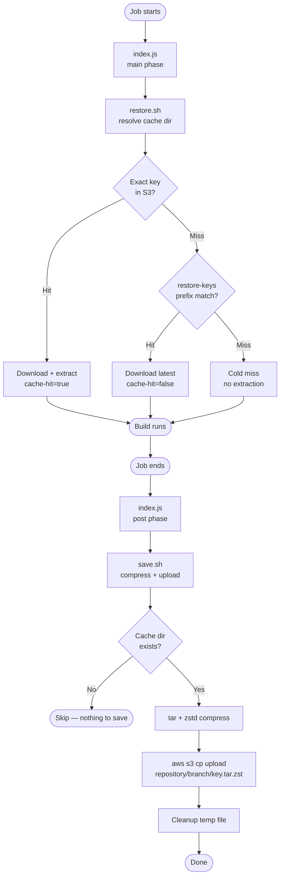

# action-go-build-cache

A GitHub Action that restores and saves Go's build cache (`GOCACHE`) using an S3 bucket. Designed for use across multiple repositories that share the same bucket — each repository and branch is isolated by a structured key prefix.

Save runs **automatically as a post-step** at the end of the job. No separate save step needed.

## How It Works



**On restore (job start):**
1. Resolves the cache directory — uses `path` input if provided, otherwise `go env GOCACHE`
2. Tries the exact key in S3 → downloads and extracts if found (`cache-hit=true`)
3. Falls back through `restore-keys` prefixes, picking the most recently modified object for each → downloads and extracts on first match (`cache-hit=false`)
4. Cold miss if nothing found — build proceeds from scratch

**On save (job end, automatic):**
1. Compresses the cache directory with `tar` + `zstd`
2. Uploads the archive to S3 under `<repository>/<branch>/<key>.tar.zst`
3. Cleans up the local temp archive

## S3 Key Structure

All repositories share a single bucket, namespaced by repository and branch:

```
<bucket>/
  upbound-provider-upjet-aws/
    main/
      Linux-go-build-abc123.tar.zst
    release-v2.5/
      Linux-go-build-def456.tar.zst
  upbound-provider-upjet-azure/
    main/
      Linux-go-build-ghi789.tar.zst
```

Raw input values (`upbound/provider-upjet-aws`, `refs/heads/main`) are sanitized internally — slashes are replaced with hyphens. Callers pass values as-is.

### Restore fallback chain

```
1. <repository>/<branch>/Linux-go-build-<go.sum hash>   exact match
       ↓ miss
2. <repository>/<branch>/Linux-go-build-*               latest on same branch (via restore-keys)
       ↓ miss
   cold build
```

The fallback gives the best partial reuse when `go.sum` changes slightly between commits. Go's content-addressed cache reuses any unchanged artifacts regardless of the key mismatch.

## Inputs

| Input | Required | Default | Description |
|---|---|---|---|
| `repository` | yes | — | Repository name (e.g. `upbound/provider-upjet-aws`). Slashes are normalized to hyphens internally. |
| `branch` | yes | — | Branch or ref (e.g. `main`, `refs/heads/release-v2`). Slashes are normalized to hyphens internally. |
| `key` | yes | — | Exact cache key. See recommended format below. |
| `restore-keys` | no | `''` | Newline-separated list of key prefixes for fallback restore, tried in order. |
| `bucket` | yes | — | S3 bucket name. |
| `aws-region` | no | `us-east-1` | AWS region where the bucket lives. |
| `path` | no | `go env GOCACHE` | Local directory to cache. Override to cache a different directory or maintain multiple independent caches per (repository, branch) pair. |

### Recommended key format

```yaml
key: ${{ runner.os }}-go-build-${{ hashFiles('**/go.sum') }}
restore-keys: ${{ runner.os }}-go-build-
```

No branch sanitization needed in the workflow — pass `github.ref` or any ref directly; the action handles normalization.

## Outputs

| Output | Description |
|---|---|
| `cache-hit` | `true` if the exact key matched, `false` for fallback hits and cold misses |

## Authentication

The action uses the AWS CLI which reads credentials from the standard AWS credential chain. Authentication is configured by the caller — the action itself has no auth inputs.

### Recommended: GitHub OIDC → IAM Role

No long-lived credentials. The runner requests a short-lived JWT from GitHub's OIDC provider and exchanges it for temporary AWS credentials via `sts:AssumeRoleWithWebIdentity`.

#### 1. Create an IAM OIDC provider (one-time, per AWS account)

```bash
aws iam create-open-id-connect-provider \
  --url https://token.actions.githubusercontent.com \
  --client-id-list sts.amazonaws.com \
  --thumbprint-list 6938fd4d98bab03faadb97b34396831e3780aea1
```

#### 2. Create an IAM role

Create a role with this trust policy, scoped to all repos under the `upbound` org:

```json
{
  "Version": "2012-10-17",
  "Statement": [
    {
      "Effect": "Allow",
      "Principal": {
        "Federated": "arn:aws:iam::<account-id>:oidc-provider/token.actions.githubusercontent.com"
      },
      "Action": "sts:AssumeRoleWithWebIdentity",
      "Condition": {
        "StringEquals": {
          "token.actions.githubusercontent.com:aud": "sts.amazonaws.com"
        },
        "StringLike": {
          "token.actions.githubusercontent.com:sub": "repo:upbound/*:*"
        }
      }
    }
  ]
}
```

Attach an inline policy granting S3 access to the cache bucket:

```json
{
  "Version": "2012-10-17",
  "Statement": [
    {
      "Effect": "Allow",
      "Action": [
        "s3:GetObject",
        "s3:PutObject",
        "s3:ListBucket"
      ],
      "Resource": [
        "arn:aws:s3:::<bucket-name>",
        "arn:aws:s3:::<bucket-name>/*"
      ]
    }
  ]
}
```

#### 3. Add repository variables

In each repo that uses this action (or at the org level):

| Variable | Example value |
|---|---|
| `GO_BUILD_CACHE_BUCKET` | `upbound-go-build-cache` |
| `GO_BUILD_CACHE_AWS_REGION` | `us-east-1` |
| `GO_BUILD_CACHE_ROLE_ARN` | `arn:aws:iam::123456789012:role/go-build-cache` |

#### 4. Add `id-token: write` permission to your job

`id-token: write` is required so GitHub can issue an OIDC token for the job. `configure-aws-credentials` exchanges it with AWS STS via `AssumeRoleWithWebIdentity` to obtain short-lived credentials — no static keys needed.

```yaml
permissions:
  id-token: write
  contents: read
```

#### 5. Add `configure-aws-credentials` before this action

```yaml
- uses: aws-actions/configure-aws-credentials@ec61189d14ec14c8efccab744f656cffd0e33f37 # v6.1.0
  with:
    role-to-assume: ${{ vars.GO_BUILD_CACHE_ROLE_ARN }}
    aws-region: ${{ vars.GO_BUILD_CACHE_AWS_REGION }}
```

---

## Example: Provider repo usage

```yaml
name: CI

on:
  push:
    branches:
      - main
      - release-*
  pull_request: {}

jobs:
  build:
    runs-on: ubuntu-24.04
    permissions:
      id-token: write
      contents: read
    steps:
      - uses: actions/checkout@v4

      - uses: actions/setup-go@v5
        with:
          go-version-file: go.mod

      - name: Configure AWS Credentials for Go build cache
        uses: aws-actions/configure-aws-credentials@ec61189d14ec14c8efccab744f656cffd0e33f37 # v6.1.0
        with:
          role-to-assume: ${{ vars.GO_BUILD_CACHE_ROLE_ARN }}
          aws-region: ${{ vars.GO_BUILD_CACHE_AWS_REGION }}

      - name: Restore Go Build Cache
        uses: upbound/action-go-build-cache@dec0a6101102417fe60419dd996721200111e6dd
        with:
          repository: ${{ github.repository }}
          branch: ${{ github.ref }}
          key: ${{ runner.os }}-go-build-${{ hashFiles('**/go.sum') }}
          restore-keys: ${{ runner.os }}-go-build-
          bucket: ${{ vars.GO_BUILD_CACHE_BUCKET }}
          aws-region: ${{ vars.GO_BUILD_CACHE_AWS_REGION }}

      - name: Build
        run: make build

      # No save step needed — cache is saved automatically at job end.
```

### Notes

- Pass `github.repository` and `github.ref` directly — no sanitization needed in the workflow
- The save step runs automatically via the action's post-step (`post-if: always()`), even if the build fails
- A partial cache from a failed build is still useful — Go reuses any unchanged artifacts on the next run
- `GOMODCACHE` is intentionally not cached — vendor mode (`go mod vendor`) makes it unused during build; use the `path` input to add it back if needed

## S3 Bucket Lifecycle Policy

Add a lifecycle rule to the bucket to automatically delete objects older than 90 days:

```json
{
  "Rules": [
    {
      "ID": "expire-go-build-cache",
      "Status": "Enabled",
      "Filter": { "Prefix": "" },
      "Expiration": { "Days": 90 }
    }
  ]
}
```

This covers all release cycles without manual cleanup.
